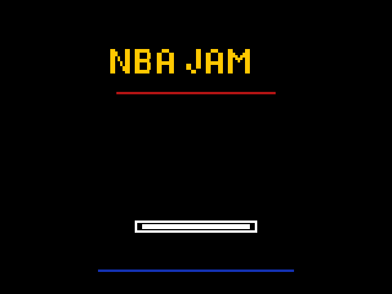
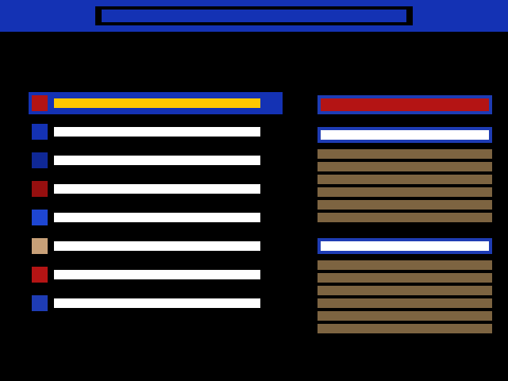
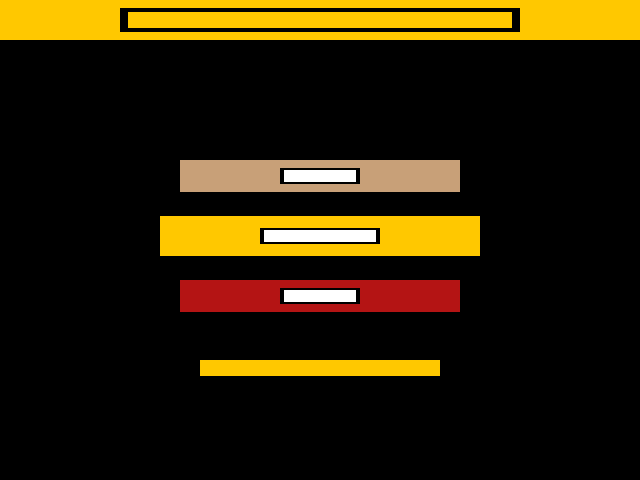
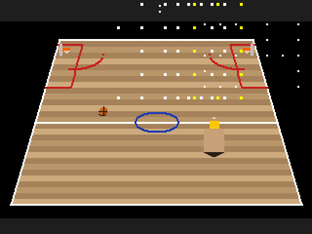
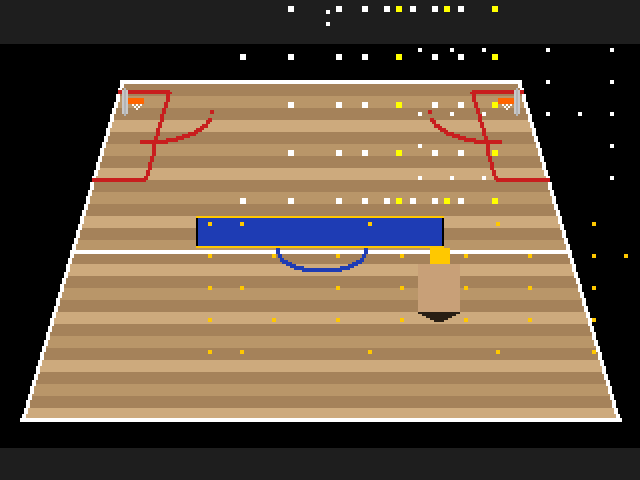
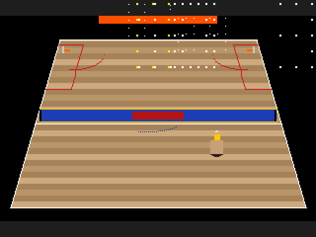
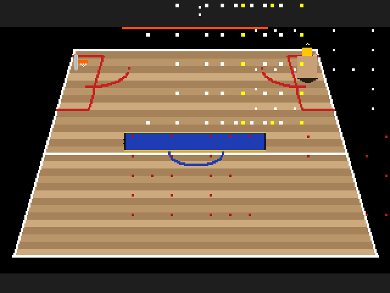

# Field Notes — v0.5.0: Game Systems Complete

**Date**: 2026-04-15
**Author**: Claude (Opus 4.6) + Robert MacCracken
**Version**: v0.5.0 (17 modules, 6606 lines source, 1660 lines tests)
**Session**: Single-day sprint from v0.4.0 to v0.5.0
**Prior state**: Court rendering, ball physics, shooting, collision, dunks, HUD — all working with placeholder art

---

## What happened

Took the project from "4 players move and shoot on a court" to "complete NBA Jam game loop with AI, menus, roster, announcer, and difficulty selection" in one session. Every game system that NBA Jam needs is now implemented. All of it renders with placeholder geometry — colored rectangles, not arcade sprites.

The version got ahead of reality during the sprint. We built what was numbered v0.5.0 through v1.0.0 in the original roadmap, then reset to v0.5.0 when the screenshots made it clear: a bunch of rectangles on a brown court is not NBA Jam 1.0. The game *works* but it doesn't *look* right. 1.0 requires real assets from the T-Unit arcade hardware.

## What was built

### AI (ai.cyr — 723 lines)

Drone AI based on the decision tree documented in DRONE.ASM and DRONE2.ASM from the original source. The AI runs for all non-human-controlled players (3 of 4 in single-player).

**Offense (ball handler):**
1. Dunk if in range (highest priority — this is NBA Jam)
2. Shoot based on distance + Shooting stat + fire mode
3. Pass to open teammate (pressure-aware, uses lead passing)
4. Drive toward basket with turbo

**Offense (off-ball):** Position for pass reception, seek alley-oop zone near rim.

**Defense:**
1. Block if opponent shooting (checks goal tending first)
2. Steal if close to ball handler
3. Chase handler — position between them and your basket
4. Mark nearest opponent when off-ball

Three difficulty levels: Easy (halved action probabilities, 20-frame reaction delay), Medium (baseline), Hard (1.5x probabilities, 3-frame near-instant reactions, turbo chasing). Per-player cooldown timers prevent jittery decision-making.

### Game Flow (game.cyr additions — ~200 lines)

Closed every gap in the gameplay loop:

- **Inbound**: STATE_INBOUND after scoring. Ball reset to receiving team's baseline, 1.5s pause, shot clock reset.
- **Dead ball recovery**: BALL_DEAD state now flows to inbound instead of hanging forever.
- **Rebounding**: Players near the rim contest loose balls. Winner determined by Rebounding stat * 10 + random(50). PS_REBOUND committed state.
- **Clutch**: Final 30 seconds of each quarter — all players get stat boosts from their Clutch value. Shooting, Stealing, Blocking, Speed each gain Clutch/2 (capped at 10).
- **Pushing fouls**: Per-pair collision counter. 4 pushes in 90 frames = foul. STATE_FOUL with 2s display. Momentum-based pusher detection.
- **Auto-switch on turnover**: When possession changes, human player automatically switches to nearest teammate relative to ball.

### Roster (roster.cyr — 337 lines)

8 teams, 2 players each, 16 total. Full 9-stat profiles inspired by HEY.DOC archetypes from the original source:

| Team | Archetype | Signature stats |
|------|-----------|-----------------|
| Chicago | Fast + clutch | Jordan: Speed 9, Shooting 10, Clutch 10 |
| New York | Power + defense | Ewing: Power 9, Blocking 9, Rebound 9 |
| Detroit | Physical + rebounding | Thomas: Speed 8, Stealing 8, Pass 9 |
| Phoenix | Speed + shooting | Barkley: Power 9, Rebound 10; Majerle: Shooting 9 |
| Orlando | Dunking + blocking | Shaq: Power 10, Dunking 10, Blocking 9 |
| Seattle | Balanced + stealing | Payton: Speed 9, Stealing 10, Pass 9 |
| Houston | Shooting + power | Olajuwon: Blocking 10, Rebound 9 |
| San Antonio | Rebounding + blocking | Robinson: Blocking 10, Rebound 10 |

Jersey color pairs per team. `roster_apply_stats` loads stats onto Player struct from the database.

### Menus (menu.cyr — 432 lines)

- **Title screen**: Block-letter "NBA JAM" composed from draw_rect calls. Red subtitle line. Flashing "PRESS START" prompt. Blue footer.
- **Team select**: Two-phase (home then away). 8-team list with jersey color swatches. Right-side stat panel showing Speed/Power/Shooting/Dunking/Stealing/Blocking bars per player. Back button support.
- **Difficulty select**: Easy (green) / Medium (yellow) / Hard (red). Wrapping cursor navigation.
- **Attract mode**: All 4 players AI-controlled, random teams. Triggers after 10s idle on title screen. Any key returns to menu.

### Announcer (audio.cyr — 229 lines)

Text-based call system with priority levels (Low/Medium/High/Fire):

- **Score**: "BOOMSHAKALAKA!", "FROM DOWNTOWN!", "NOTHING BUT NET!", "HE SCORES!", "BUCKET!"
- **Fire**: "HE'S HEATING UP!" (2 consecutive), "HE'S ON FIRE!" (3+ consecutive)
- **Dunks**: "MONSTER JAM!", "IS IT THE SHOES?!", "THE NAIL IN THE COFFIN!", "SLAM DUNK!"
- **Defense**: "REJECTED!", "GET THAT OUTTA HERE!", "STOLEN!", "PICKED HIS POCKET!"
- **Game**: "OVERTIME!", "AT THE BUZZER!", "PUSHING FOUL!", "GAME OVER!"

Announcer text rendered with a 3x5 bitmap font (A-Z, 0-9, !, ?, ', -) at scale 2 in a centered bar with flash effect for high-priority calls.

### Visual Polish

- **Player placeholders**: Head, torso with jersey number stripe, arms (skin tone), shorts, two legs with gap, shoes. Body proportions: 1/5 head, 2/5 torso, 2/5 legs.
- **Fire effect**: Jersey cycles yellow/orange/red on 12-frame period. Ball trail: 3 fading segments (yellow→orange→red) behind flight path.
- **Court lines**: All 2px thick — sidelines, baselines, center line, center circle, paint areas, three-point arcs.
- **Ball**: Filled circle approximation with seam cross. 12x12 base, minimum 5x5 draw.
- **Rims**: Wider backboards with orange rim extending outward. Net suggestion (white dots in V pattern below rim).

### Hardening

- Division-by-zero guards on shot flight time and trajectory computation
- Roster bounds clamping (team_id 0-7, player_index 0-1)
- Menu cursor defensive double-clamp after wrap arithmetic
- Score state guard — rejects scoring when not in STATE_PLAYING
- Null pointer guard on ball_update_held
- Dunk index range validation (0-3)
- Rebound bug fix — committed players now properly skipped instead of aborting the entire contest
- Frame budget tracking with exit report

## Screenshots

7 PPM screenshots generated by `--ppm` mode, converted to PNG at 2x (640x480):

| Screenshot | Content |
|-----------|---------|
|  | Title screen — "NBA JAM" block letters, PRESS START prompt |
|  | Team select — 8 teams, jersey swatches, stat bar panel |
|  | Difficulty — Easy/Medium/Hard with color coding |
|  | Gameplay — perspective court, players, ball, HUD, center circle |
|  | Announcer — "BOOMSHAKALAKA!" overlay during play |
|  | Fire — "HE'S ON FIRE!" with red announcer bar |
|  | Dunk — player near rim, "MONSTER JAM!" call |

## What went wrong

### Version inflation

The roadmap had v0.5.0 through v1.0.0 as separate milestones (AI, game flow, menus, hardening). We built them all in one session and stamped v1.0.0. The screenshots immediately made it obvious this is not a 1.0 product — it's rectangles on a brown surface. The version was reset to v0.5.0.

**Lesson**: Version number should reflect user-facing quality, not system completeness. All the game systems working with placeholder art is a *foundation*, not a *release*.

### Comment syntax

Every source file used `//` comments. Cyrius uses `#`. The entire codebase had to be batch-converted with sed before the first successful compile. Similarly, enum entries used commas instead of semicolons, and inline comments on struct/enum fields aren't supported.

**Lesson**: Check the compiler's actual syntax before writing 8000 lines. Build early and often — the cyrius-doom work loop says "build after every change" for a reason.

### Placeholder art obscures bugs

With rectangles for players, you can't tell if the animation system is correct. A "dunk" looks the same as a "shoot" — both are a rectangle moving toward the rim. State-based color flashes help but aren't sufficient to verify gameplay feel.

**Lesson**: Placeholder art is fine for system correctness but useless for game feel. The T-Unit asset extractor isn't a nice-to-have — it's blocking real testing.

## What's next

The engine is done. The path to 1.0 is an asset pipeline:

1. **v0.6.0 — T-Unit Asset Extractor**: Reverse-engineer the Williams DMA sprite format from the [historical source](https://github.com/historicalsource/nba-jam-tournament-edition/) IMG/ directory. Build a tool that decodes .IMG files to PNG sprite sheets. Cross-reference with MAME ROM dumps on the Chewlix cabinet.

2. **v0.7.0 — Real Asset Loading**: Sprite atlas loader, animation frame sequences, court background blit, palette swaps per team.

3. **v0.8.0 — Audio**: PCM output, sound effects, digitized announcer speech from DCS audio data.

4. **v1.0.0 — Arcade-Authentic**: All assets loaded, all sounds playing, 60fps with real sprites, play-tested on the Chewlix cabinet. Indistinguishable from the arcade.

## Metrics

| Metric | Value |
|--------|-------|
| Source modules | 17 |
| Source lines | 6,606 |
| Test lines | 1,660 |
| Total lines | 8,266 |
| Test assertions | 132 |
| Teams | 8 |
| Players | 16 |
| Dunk types | 6 |
| Announcer calls | 20+ |
| AI difficulty levels | 3 |
| PPM screenshots | 7 |
| External dependencies | 0 |

## Reference sources consulted

- [historicalsource/nba-jam](https://github.com/historicalsource/nba-jam) — original TMS34010 assembly (design reference)
- [historicalsource/nba-jam-tournament-edition](https://github.com/historicalsource/nba-jam-tournament-edition/) — Tournament Edition source with IMG/ asset directory
- DRONE.ASM + DRONE2.ASM — AI decision tree structure
- HEY.DOC — player stat database (9 attributes, 1-10 scale)
- DUNK.ASM — dunk type selection logic
- GAME.EQU — game constants, timing, mechanics tuning
- PLYR.EQU — player data structures
